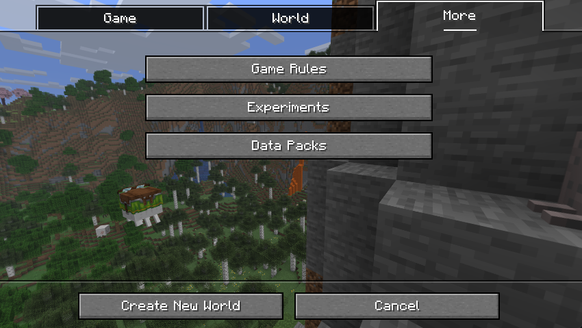

# Force Item Datapack

Force Item is a Minecraft Datapack for 1.21.8+ where each team needs to find random items in the given time. The team who found the most items wins.

## Installation

1. Download the `.zip`-archive or clone this repository.

2. Create a new Minecraft World and click on `More` > `Datapacks`

   

3. Click on `Open Pack Folder` and copy the downloaded folder in this directory
